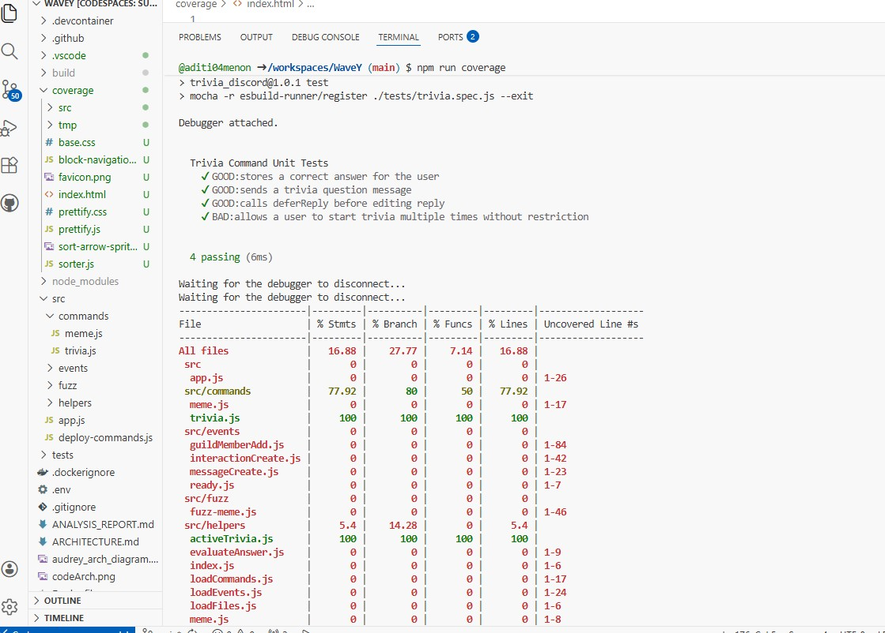

**Unit Testing Report:**

**Results:**

I analyzed the /trivia command used to trigger functionality and design within the Trivia Discord bot. This process involved four unit tests, stored in the tests folder and defined in trivia.spec.js, to validate 3 expected functionalities and address one weakness in the current implementation. 

**Successes:**

The first unit test recognized that the bot correctly stored the answer to the trivia question. This is a core functionality of the trivia bot: when the user enters an answer, the bot must correlate it with the correct answer to the question. Internally, this guarantees that the state of the map that holds the answer is functioning, user answers are being stored properly, and the core logic of the game is functioning. 
The second unit test examined how the bot sends a trivia question to the user when the /trivia command is invoked. This confirmed that the bot is interacting correctly with the user, responding appropriately, and that the command is being recognized and executed correctly. 
The third unit test tested the interaction lifecycle and its handling within the bot. Our bot calls deferReply() before editReply(0). Call: this is important to test because Discord requires bots to respond within 3 seconds; otherwise, it will time out. So the deferReply() call is vital to the functionality because it acknowledges the timeout immediately and says, "Hold on, I'm thinking while I grab a question." These functions passed the unit test, meaning that the bot is handling these interactions correctly. 

**Weaknesses:**

A fourth unit test was added to catch a scenario I had been wondering about after testing another bot from a different group. It was to check whether there are any restrictions on spamming the /trivia (initialization command). The test results show that the bot does not prevent users from spamming the /trivia command and can open multiple sessions, with no per-user limit or checks to prevent misuse. This weakness could be problematic, as it may cause the bot to crash or experience performance issues. 

**Overall:**

While building this bot, our team focused on functionality. So some features such as spamming, session timeout, and invalid input were all noticed throughout the testing and analyzing phase. This bot’s core functionality is working, and going forward, we will focus on adding features to support user error rather than just how it needs to run. 

By: 
Giselle McNeill 
02/13/2026

 **Test Coverage Analysis (c8 + Mocha) : By Aditi Menon**

To evaluate how thoroughly our automated test suite exercises the WaveY codebase, we ran test coverage using the c8 coverage tool integrated with Mocha. This analysis measured the percentage of executed statements, branches, functions, and lines across all source files in the src directory.

Overall, the project achieved **16.88% statement and line coverage, 27.77% branch coverage, and 7.14% function coverage**, indicating that the current tests focus primarily on specific core functionality rather than the entire system. The highest coverage occurred within the trivia feature, where src/commands/trivia.js and src/helpers/activeTrivia.js both reached 100% coverage across all metrics. This confirms that the trivia command workflow and internal trivia state management are fully exercised by the unit tests, which aligns with the work done by Giselle.

However, **several major components showed 0% coverage**, including the bot startup logic (app.js), all event handlers (interactionCreate.js, messageCreate.js, guildMemberAdd.js, and ready.js), and most helper utilities such as evaluateAnswer.js and command loaders. These areas were not triggered by the current unit tests, which explains the lower overall coverage percentages.

Going forward, coverage could be improved by adding targeted tests for event handlers and helper functions. Expanding test breadth in these areas would increase confidence in system reliability and reduce the risk of runtime errors during real user interactions.

**Fuzzer Test Analysis: Jayda Fountain**

**Action**
I wrote a fuzzer test to try and break our code so we can find gaps in our trivia bot without having to manually try a bunch of inputs in the discord chat. While writing the fuzzer, I decided to test our answer evaluating code because that is the main part of our program that can crash based on input. To accomplish this, I thought like a bad actor by changing the case of the inputs from lower to upper and vice versa to see if the output was the same. I also tried other inputs such as emojis, numbers, special symbols, extra spacing, repeated characters, and a null value to see if the code evaluates it correctly.

**Result - Passes**
After running the "npm run fuzz" command that I added, I found that in cases where the case of the answer was changed or extra spacing was added did not effect the evaluation which is great! If the user accidentally adds spacing after or before their answer, we do not need to worry. For emojis, numbers, and special symbols they also did not crash the code and simply processed it as a normal string and returned false. I did also try out repeated characters to see how the code would act and it returned false which makes sense but I wonder if we should look further into that in the future. If the user accidentally typed "AA" instead of "A" on accident, I wonder if we should check if only a's are used in the answer then it will be true no matter how many are used (when the correct answer is A). But either way, this fuzzer will help us test this no matter if we change it or not!

**Result - Fails**
For failed cases, I found that there was one failed case as displayed in the picture above. I found that if the value returned is null, the code as usual tries to make it lowercase to process the answer but since it is null, it cannot properly change it to lowercase in the first place, resulting in an error. To fix this, an if statement to check if the code is null first should be implemented so the code can catch the error and return an error message instead of crashing the bot.

**Reflection**
When thinking back to the process of creating our bot and testing it, I think we did a good job of thinking like a bad actor to think of issues ahead of time. I think that our code properly processes the user input as a result and can handle the responses for the most part besides if a null value is returned which I am not sure is entirely possible via discord. In the future, we plan on adding a feature to address wrong inputs to maybe give the user a second chance so I think we have been doing good with testing and accounting for how the user can/will act.

